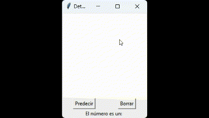

# Un Predictor de números escritos a mano utilizando el clásico dataset MNIST.
### Viene incluida una pequeña interfaz con tkinter para probar el modelo escribiendo los número directamente con el mouse.

La identificación de números escritos a mano mediante redes neuronales es una tarea clásica en Deep Learning, sirve para tareas de visión por computadora. Utilizando conjuntos de datos etiquetados, **como el conjunto de datos MNIST**, que contiene miles de imágenes de números y sus etiquetas reales. Estos modelos aprenden a reconocer y clasificar dígitos numéricos.

Este tipo tareas tienen aplicaciones practicas en procesamiento de imágenes, digitalización de documentos, clasificación automática de formularios y detección de fraudes.

**Como he mencionado, vamos a entrenar un modelo de red neuronal utilizando el conjunto de datos [MNIST](https://datascience.eu/es/procesamiento-del-lenguaje-natural/base-de-datos-del-mnist/#:~:text=la%20base%20de%20datos%20del,sistemas%20de%20manejo%20de%20im%C3%A1genes.)**

### Voy a intentar explicar cada uno de los pasos de manera sencilla y tambien puedes ver el código en el repositorio.

El dataset MNIST contiene las imágenes de entrenamiento y prueba, así como las etiquetas correspondientes que indican qué dígito representa cada imagen.

    import tensorflow as tf
    from tensorflow.keras.datasets import mnist
    import numpy as np
  
    (x_train, y_train), (x_test, y_test) = mnist.load_data()

 **Preprocesamiento de los datos**

     x_train = x_train / 255.0 
     x_test = x_test / 255.0

Las imagenes de MNIST están en escala de grises. Primero se realiza un preprocesamiento de los datos dividiendo los valores de cada pixel entre 255 para normalizarlos y que estén en un rango de 0 a 1. La escala de grises generalmente se representa en números de 0 a 255.

**Esto facilita el paso por la red neuronal.**

> En este rango, el valor 0 representa el **negro absoluto (sin intensidad de luz)** y el valor 255 representa el **blanco absoluto** (máxima intensidad de luz).
>> La razón por la cual se utiliza el rango de 0 a 255 es por la representación de 8 bits, donde cada píxel en una imagen _en blanco y negro_, se almacena como un valor de 8 bits (1 byte). Con 8 bits, se pueden representar 2^8 = 256 valores distintos, es decir, desde 0 hasta 255. Cada valor representa un nivel de intensidad de luz en la escala de grises.

### Paso 3: Crear el modelo de la red neuronal

    from tensorflow.keras.models import Sequential
    from tensorflow.keras.layers import Flatten, Dense
    
    model = Sequential()
    model.add(Flatten(input_shape=(28, 28)))
    model.add(Dense(units=128, activation='relu'))
    model.add(Dense(units=128, activation='relu'))
    model.add(Dense(units=128, activation='relu'))
    model.add(Dense(units=10, activation='softmax'))
    
1. Creamos el modelo de red neuronal utilizando la API de Keras. El modelo consta de una capa **Flatten()** o de _aplanamiento_ que convierte las características 2D en un vector 1D. 
2. Seguimos con tres capas ocultas Dense(units=128, activation='relu'): las capas Dense son capas completamente conectadas con **128 unidades (neuronas)** y función de activación ReLU(_explicación más abajo_). Debo decir que esto puede variar y podriamos probar por ejemplo con una sola capa totalmente conectada pero de 1024 unidades.
3. Por ultimo una capa de salida **fully connected** (Dense) pero con 10 unidades (una para cada dígito posible) y función de activación softmax. La función softmax asigna probabilidades a cada clase por eso se utiliza en problemas de clasificación multiclase.

### Paso 4: Compilar el modelo.

    model.compile(optimizer='adam',
              loss='sparse_categorical_crossentropy',
              metrics=['accuracy'])
              
Básicamente, compilar es definir el modelo y sus hiperparámetros, especificando el optimizador, la función de pérdida y las métricas que se utilizarán durante el entrenamiento. En este caso, se utiliza el optimizador [Adam: A Method for Stochastic Optimization](https://arxiv.org/abs/1412.6980), la función de pérdida **sparse_categorical_crossentropy** es apropiada para clasificación multiclase además medimos la precisión.

### Paso 5: Entrenar el modelo.
Se entrena el modelo utilizando los datos de entrenamiento durante 50 epochs. Durante el entrenamiento, el modelo aprenderá a reconocer y clasificar los dígitos de el dataset MNIST

### Paso 6: Evaluar el modelo con el conjunto de prueba.

Una vez entrenado el modelo, se evalúa su rendimiento utilizando el conjunto de prueba. Se calcula la pérdida y la precisión mientras veía las imágenes de prueba. La precisión indica qué tan bien clasifica el modelo los dígitos que nunca ha visto.

## Creación de la app de Tkinter para dibujar el número

Si queremos probar la app con ejemplos reales, que mejor que poder dibujar el número en la pantalla y que este nos diga cual es, para este experimento lo primero que debemos hacer es guardar el modelo que creamos.

    model.save('modelo_mnist_keras')
**Esto creará una carpeta en el directorio donde estes trabajando.**

1. La app de tkinter, tiene la dependencia de PILLOW y numpy para procesar imagenes.
2. Creamos una interfaz para dibujar el número con el mouse y una vez dibujado, una función para procesar el digito, por ejemplo redimensionar y cambiarle el fondo para que se parezcan a los digitos mnist y que esten en el formato adecuado.
3. Creamos la función de predicción que nos dirá que número puede ser el que se ha dibujado.
 
Puedes ver el código completo [aqui](tkinter_prediction_app.py)

## Algunas dudas que me surgieron e investigué un poco.

- **Por que en los libros veia 64, 128 y hasta 1024 unidades en la capa oculta Dense (totalmente conectada)?**

R: En general, una mayor cantidad de unidades en las capas densas permite que el modelo **aprenda representaciones más complejas** y no tan básicas de los datos de entrada. Sin embargo, agregar más unidades también aumenta la cantidad de parámetros en el modelo, lo que puede lleva a un **mayor consumo de recursos** y un mayor **riesgo de sobreajuste.**

En este caso, utilicé varios, pero con el valor de 128 unidades obtuve un rendimiento adecuado. Este valor es comúnmente utilizado en una variedad de tareas de clasificación de imágenes, incluso lo he visto en muchas implementaciones de reconocimiento de dígitos MNIST.

_El número óptimo de unidades en las capas densas puede variar dependiendo del problema específico y de la arquitectura del modelo._

- **Por qué la funcion de activación ReLU para las capas totalmente conectadas del medio de la red?**

R: ReLU introduce _no linealidad_ en la red neuronal, lo que **permite al modelo aprender relaciones complejas** entre las características de entrada y las salidas. Las redes neuronales sin funciones de activación no lineales como ReLU serían equivalentes a modelos lineales, lo que conlleva que no aprendan patrones dificiles en los datos sino relaciones lineales simples.

- **쮺칩mo funciona ReLU?**

Cuando se aplica la función ReLU a una neurona, si la entrada es mayor que cero, la salida será igual a la entrada. Si la entrada es menor o igual a cero, la salida será cero. En términos gráficos, la función ReLU traza una línea recta que comienza en el origen y se extiende hacia arriba en un ángulo de 45 grados.

 

[Más sobre ReLU](https://es.wikipedia.org/wiki/Rectificador_(redes_neuronales))

Espero que esta breve explicación ayude a comprender un poco mejor algunos conceptos de el impresionante 🌠Deep learning🌠, a mi me ha servido bastante para practicar y entender los principios de redes neuronales

### Conocimiento y agradecimientos:
- https://github.com/rasbt/python-machine-learning-book-3rd-edition
- https://twitter.com/santiagohramos

### Gracias por leer.✔️

